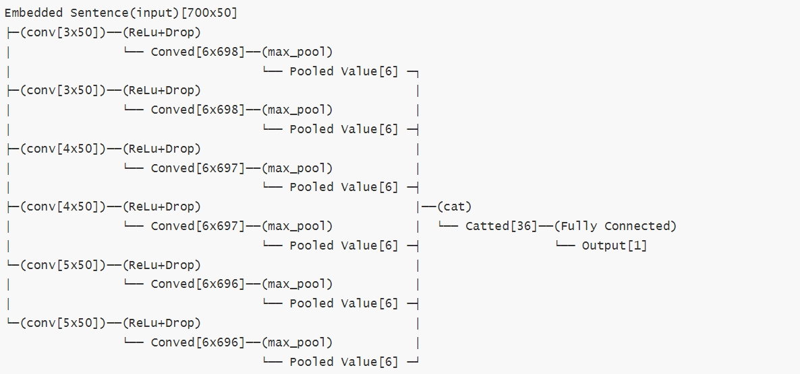
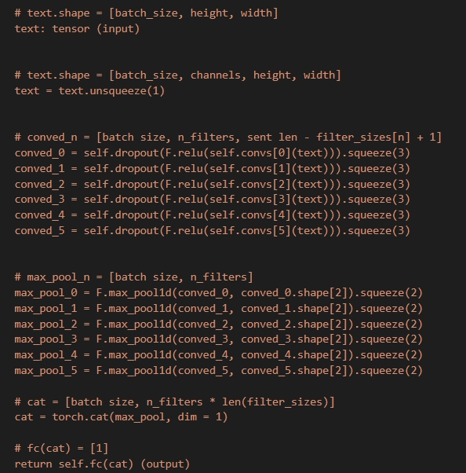
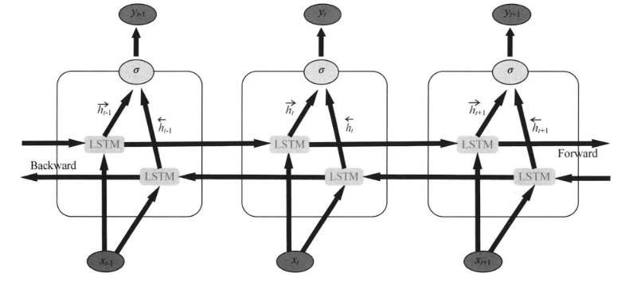
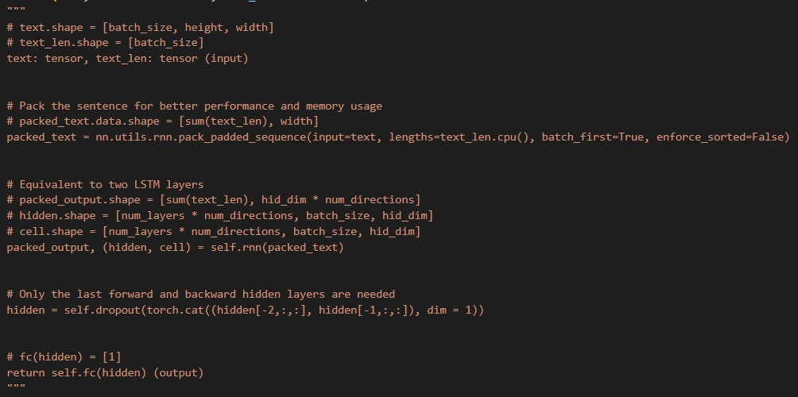
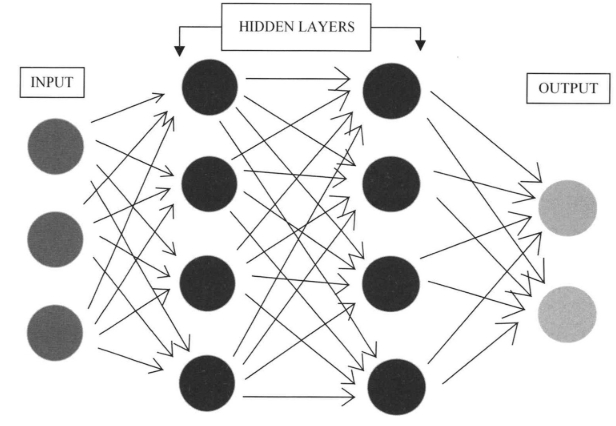
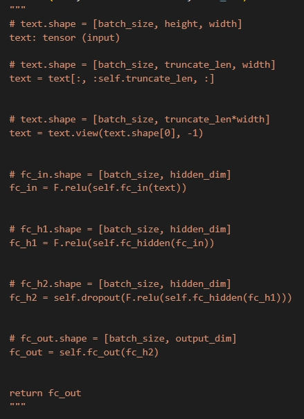
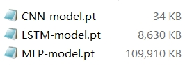
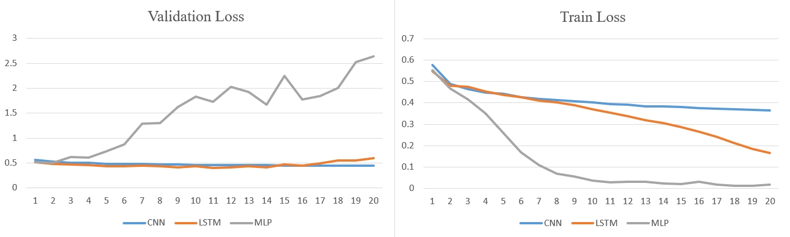

# 《人工智能导论》实验二 --- 情感分析

罗绍玮 2022010749

云盘链接: https://cloud.tsinghua.edu.cn/d/455a8679baf447f88ff5/

git 鏈接: https://github.com/asd13902594299/CNN-LSTM-MLP-based-emotion-classification.git

## 1    模型的结构图，以及流程分析

### **CNN**

#### 流程分析

与课上讲的 CNN 类似.

不过需要在训练和测试之前, 对句子进行 padding, 使得每个句子分词后的长度一样. 由于训练测试验证集的分词后长度最多为 700, 因此我选择把所有句子都 padding 到 700, 且设置这个 padding 字符在词向量中的值为全 0, 保证不会影响训练时的结果. 此外, 还对一些不在词向量的词进行一个 unknown 替代, 且设置这个 unknown 字符在词向量中的值为全 0, 保证不会影响训练时的结果.

1. 用 $n$ 个卷积核对句子每个词进行卷积, 卷积核的宽度与词向量的维度一致, 且每次卷积都会输出 $n$ 个 channel.

2. 卷积后会得到 $n$ 个 $m \times 1$ 的向量, 这个 $m$ 根据卷积核长度决定.

3. 对上述向量进行 ReLU, Dropout 和最大池化操作, 降低模型过拟合程度.

4. 最后就是把 $n$ 个池化后的向量, 拼接起来, 然后丢到全连接层得到输出.

#### 结构图

过程中的一些维度上的 `squeeze` 和 `unsqueeze` 操作就略过不说了.

`Embedded Sentence` 维度是: `[logest_sentence_len x word_vector_width]`

`Conved Sentence` 维度是: `[num_of_conv_Kernel x (logest_sentence_len - Kernel_height + 1)]`

`Pooled Value` 维度是: `[num_of_conv_Kernel]`

`Catted Sequence` 维度是: `[num_of_conv_Kernel x num_of_conv_Kernel ]`





### **LSTM**

#### 流程分析

同 CNN 需要先进行 padding 和 unknown 替代处理.

同时进入网络的参数需要额外输入一个句子长度, 用于 `pack_padded_sequence` 以降低内存和性能占用.

1. 把分词后的句子和其对应长度进行 `pack_padded_sequence`,

2. 就把 pack 好的句子丢进去双向 LSTM 模块中过两层,

3. 就是取出最后的隐藏层的结果, 过一次全连接层得到输出.

#### 结构图





### MLP

#### 流程分析

1. 把预处理(padding, 替代 unknown)后的输入进行截断, 否则网络会过于巨大以及学习很多无用的 padding.

2. 把截断后的句子压缩成一维.
3. 把句子过两隐藏全连接层, 隐藏层的维度与输入一致, 同时在隐藏层阶段进行 ReLU 和 Dropout.
4. 最后一个全连接输出维度为 1 的结果.





## 2    实验结果，准确率，F-score 标的实验效果

### CNN

|       参数       |      值       |
| :--------------: | :-----------: |
|  EMBEDDING_DIM   |      50       |
|   KERNEL_SIZES   | [3,3,4,4,5,5] |
|     N_KERNEL     |       6       |
|    OUTPUT_DIM    |       1       |
|     DROPOUT      |      0.5      |
| MAX_SENTENCE_LEN |      700      |

训练 20 个 epoch 的训练 / 验证 / 测试集的准确率和 F-score 结果:

```
The model has 7,273 trainable parameters
Epoch: 01 | Epoch Time: 0m 3s
        Train Loss: 0.574 | Train Acc: 71.00% | F-score: nan
         Val. Loss: 0.553 |  Val. Acc: 75.77% | F-score: 0.74
Epoch: 02 | Epoch Time: 0m 2s
        Train Loss: 0.485 | Train Acc: 76.45% | F-score: 0.76
         Val. Loss: 0.519 |  Val. Acc: 77.26% | F-score: 0.76
Epoch: 03 | Epoch Time: 0m 2s
        Train Loss: 0.464 | Train Acc: 77.99% | F-score: 0.78
         Val. Loss: 0.510 |  Val. Acc: 76.53% | F-score: 0.74
Epoch: 04 | Epoch Time: 0m 2s
        Train Loss: 0.448 | Train Acc: 78.84% | F-score: 0.79
         Val. Loss: 0.500 |  Val. Acc: 77.09% | F-score: 0.74
Epoch: 05 | Epoch Time: 0m 2s
        Train Loss: 0.437 | Train Acc: 79.58% | F-score: 0.79
         Val. Loss: 0.487 |  Val. Acc: 78.78% | F-score: 0.78
Epoch: 06 | Epoch Time: 0m 2s
        Train Loss: 0.428 | Train Acc: 79.98% | F-score: 0.80
         Val. Loss: 0.482 |  Val. Acc: 79.21% | F-score: 0.80
Epoch: 07 | Epoch Time: 0m 2s
        Train Loss: 0.419 | Train Acc: 80.84% | F-score: 0.81
         Val. Loss: 0.480 |  Val. Acc: 78.91% | F-score: 0.77
Epoch: 08 | Epoch Time: 0m 3s
        Train Loss: 0.413 | Train Acc: 81.10% | F-score: 0.81
         Val. Loss: 0.470 |  Val. Acc: 79.98% | F-score: 0.80
Epoch: 09 | Epoch Time: 0m 2s
        Train Loss: 0.407 | Train Acc: 81.38% | F-score: 0.81
         Val. Loss: 0.467 |  Val. Acc: 79.70% | F-score: 0.80
Epoch: 10 | Epoch Time: 0m 2s
        Train Loss: 0.402 | Train Acc: 81.87% | F-score: 0.82
         Val. Loss: 0.465 |  Val. Acc: 79.60% | F-score: 0.79
after training...
Epoch: 20
        Train Loss: 0.368 | Train Acc: 83.49% | F-score: 0.83
         Val. Loss: 0.452 |  Val. Acc: 79.99% | F-score: 0.78
         Test Loss: 0.426 |  Test Acc: 83.65% | F-score: 0.83
```

### LSTM

|       参数       |  值  |
| :--------------: | :--: |
|  EMBEDDING_DIM   |  50  |
|    HIDDEN_DIM    | 256  |
|    OUTPUT_DIM    |  1   |
|     N_LAYERS     |  2   |
|     DROPOUT      | 0.5  |
| MAX_SENTENCE_LEN | 700  |
|  BIDIRECTIONAL   | True |

训练 20 个 epoch 的训练 / 验证 / 测试集的准确率和 F-score 结果:

```
The model has 2,208,257 trainable parameters
Epoch: 01 | Epoch Time: 0m 5s
        Train Loss: 0.535 | Train Acc: 72.54% | F-score: nan
         Val. Loss: 0.502 |  Val. Acc: 76.25% | F-score: 0.77
Epoch: 02 | Epoch Time: 0m 5s
        Train Loss: 0.486 | Train Acc: 76.75% | F-score: 0.76
         Val. Loss: 0.498 |  Val. Acc: 76.18% | F-score: 0.74
Epoch: 03 | Epoch Time: 0m 5s
        Train Loss: 0.472 | Train Acc: 77.70% | F-score: 0.77
         Val. Loss: 0.472 |  Val. Acc: 77.28% | F-score: 0.77
Epoch: 04 | Epoch Time: 0m 5s
        Train Loss: 0.450 | Train Acc: 79.00% | F-score: 0.78
         Val. Loss: 0.453 |  Val. Acc: 78.49% | F-score: 0.78
Epoch: 05 | Epoch Time: 0m 5s
        Train Loss: 0.443 | Train Acc: 79.71% | F-score: 0.79
         Val. Loss: 0.452 |  Val. Acc: 78.81% | F-score: 0.79
Epoch: 06 | Epoch Time: 0m 5s
        Train Loss: 0.426 | Train Acc: 80.60% | F-score: 0.80
         Val. Loss: 0.445 |  Val. Acc: 79.55% | F-score: 0.81
Epoch: 07 | Epoch Time: 0m 5s
        Train Loss: 0.413 | Train Acc: 81.24% | F-score: 0.81
         Val. Loss: 0.496 |  Val. Acc: 76.37% | F-score: 0.80
Epoch: 08 | Epoch Time: 0m 5s
        Train Loss: 0.401 | Train Acc: 82.02% | F-score: 0.82
         Val. Loss: 0.426 |  Val. Acc: 80.41% | F-score: 0.80
Epoch: 09 | Epoch Time: 0m 5s
        Train Loss: 0.384 | Train Acc: 82.93% | F-score: 0.83
         Val. Loss: 0.416 |  Val. Acc: 81.38% | F-score: 0.81
Epoch: 10 | Epoch Time: 0m 5s
        Train Loss: 0.369 | Train Acc: 83.80% | F-score: 0.84
         Val. Loss: 0.413 |  Val. Acc: 81.22% | F-score: 0.82
after training...
Epoch: 20
        Train Loss: 0.169 | Train Acc: 93.33% | F-score: 0.93
         Val. Loss: 0.613 |  Val. Acc: 80.48% | F-score: 0.81
         Test Loss: 0.514 |  Test Acc: 82.42% | F-score: 0.83
```

### MLP

EMBEDDING_DIM = word2vec.vector_size
OUTPUT_DIM = 1
DROPOUT = 0.5
MAX_SENTENCE_LEN = 700
TRUNCATE_LEN = 75
HIDDEN_DIM = int((TRUNCATE_LEN*EMBEDDING_DIM))

|       参数       |     值     |
| :--------------: | :--------: |
|  EMBEDDING_DIM   |     50     |
|    OUTPUT_DIM    |     1      |
|     DROPOUT      |    0.5     |
| MAX_SENTENCE_LEN |    700     |
|   TRUNCATE_LEN   |     75     |
|    HIDDEN_DIM    | 75*50=3750 |

```
The model has 28,136,251 trainable parameters
Epoch: 01 | Epoch Time: 0m 2s
        Train Loss: 0.552 | Train Acc: 71.18% | F-score: nan
         Val. Loss: 0.503 |  Val. Acc: 75.66% | F-score: 0.75
Epoch: 02 | Epoch Time: 0m 2s
        Train Loss: 0.463 | Train Acc: 78.33% | F-score: 0.78
         Val. Loss: 0.510 |  Val. Acc: 75.43% | F-score: 0.75
Epoch: 03 | Epoch Time: 0m 2s
        Train Loss: 0.416 | Train Acc: 80.68% | F-score: 0.81
         Val. Loss: 0.548 |  Val. Acc: 75.17% | F-score: 0.74
Epoch: 04 | Epoch Time: 0m 2s
        Train Loss: 0.340 | Train Acc: 84.78% | F-score: 0.85
         Val. Loss: 0.612 |  Val. Acc: 73.51% | F-score: 0.72
Epoch: 05 | Epoch Time: 0m 2s
        Train Loss: 0.265 | Train Acc: 88.71% | F-score: 0.89
         Val. Loss: 0.895 |  Val. Acc: 72.38% | F-score: 0.69
Epoch: 06 | Epoch Time: 0m 2s
        Train Loss: 0.174 | Train Acc: 92.80% | F-score: 0.93
         Val. Loss: 0.938 |  Val. Acc: 70.85% | F-score: 0.74
Epoch: 07 | Epoch Time: 0m 2s
        Train Loss: 0.108 | Train Acc: 95.79% | F-score: 0.96
         Val. Loss: 1.248 |  Val. Acc: 71.89% | F-score: 0.69
Epoch: 08 | Epoch Time: 0m 2s
        Train Loss: 0.072 | Train Acc: 97.37% | F-score: 0.97
         Val. Loss: 1.290 |  Val. Acc: 71.48% | F-score: 0.71
Epoch: 09 | Epoch Time: 0m 2s
        Train Loss: 0.049 | Train Acc: 98.18% | F-score: 0.98
         Val. Loss: 1.574 |  Val. Acc: 72.20% | F-score: 0.72
Epoch: 10 | Epoch Time: 0m 2s
        Train Loss: 0.035 | Train Acc: 98.69% | F-score: 0.99
         Val. Loss: 1.793 |  Val. Acc: 71.88% | F-score: 0.71
after training...
Epoch: 20
        Train Loss: 0.021 | Train Acc: 99.29% | F-score: 0.99
         Val. Loss: 2.058 |  Val. Acc: 71.31% | F-score: 0.70
         Test Loss: 1.628 |  Test Acc: 74.07% | F-score: 0.74
```

## 3    试简要地比较实验中使用的不同参数效果，并分析原因

我所实现的三个模型都是使用 Adam 作为 optimizer, 以及 BCEWithLogitsLoss 作为 criterion.

显然, 当模型变得更复杂, 参数量更多的时候, 在训练集上得到的结果就会更好, 因为模型的参数是根据训练集的结果进行调整的. 因此会逐渐对训练集出现**过拟合**现象.

这几乎是所有模型都有的迹象. 可训练参数越多时, 训练集的准确率会不断上升, 且训练一个 epoch 时间会随之上升. 但验证集只会在开始的几个 epoch 有明显上升迹象, 后续 epoch 几乎就是震荡.

在 CNN 模型中, 我尝试对卷积核数量和核大小以及层数进行调整, 结果与预期的差不多. 

- 在目前选定的超参数中, 有 7,273 可训参数, 是三模型中最少的, 在训了 6 个 epoch 左右, 训练集的正确率也几乎收敛了.

在 LSTM 模型中, 我尝试对 LSTM 层数和其隐藏层维度进行调整, 结果与预期的差不多. 

- 在目前选定的超参数中, 有 2,208,257 可训参数, 是三模型中第二少的, 在训了 20 个 epoch 左右, 训练集的正确率也有一直上升, 不过验证集和测试集的准确率在 82% 左右震荡, 并没隨训练 epoch 上升而上升.

在 MLP 模型中, 我尝试对隐藏层数和维度进行调整, 结果与预期的差不多. 

- 在目前选定的超参数中, 有 28,136,251 可训参数, 是三模型中第最多的的. 随着 epoch 数量增加, 训练集的正确率一直剧烈上升, 设置在 20 个 epoch 时达到了 99% 的正确率.
- 同时, 验证集在 epoch 多的时候, 设置不如前面的 epoch 结果. 因此可以断定, MLP 在 epoch 数过多的时候出现了明显的过拟合问题.

我们也可以透过保存模型参数的文件大小判断其参数量和过拟合程度.



## 4    比较baseline模型与CNN，RNN模型的效果差异

MLP, CNN, LSTM 在 20 个 epoch 过程中的 Loss.

可见在 MLP 中, Loss 的在训练集上的下降速度非常的快; 其次是 LSTM; 最后是 CNN.

然而在验证集上, MLP 的 Loss 可谓是剧烈上升; 而 LSTM 在 epoch 14 之前都是比 CNN 高的, 随后就比 CNN 低了.



MLP, CNN, LSTM 在 20 个 epoch 过程中的 Accuracy.

可见在 MLP 中, Accuracy 的在训练集上的准确率在 9 个 epoch 左右就接近到 1 了; 其次是 LSTM 缓慢线性上升到 0.92 左右; 最后是 CNN 逐渐线性上升到 0.83.

然而在验证集上, MLP 的 Accuracy 只在 0.75 附近震荡; 而 LSTM 和 CNN 均是稳定在 0.8 以上.


因此可以总结, MLP 的参数量最多, Accuracy 很快就过拟合到训练集了; 其次是 LSTM, 参数量第二多, 不过过拟合迹象很微弱; 最后是 CNN, 参数量很少, 但无论是在测试集, 训练集, 还是验证集中, 都有着良好的表现.

## 5    问题思考

**1）  实验训练什么时候停止是最合适的？简要陈述你的实现方式，并试分析固定迭代次数与通过验证集调整等方法的优缺点。**

本实验中选用固定迭代次数, 并保存其中验证集 Loss 最低最高的模型.

- 验证集调整的方式:
  - 好处是比较灵活, 对于不同参数能够有效在达到最佳准确率停止迭代.
  - 坏处是需要从训练集中划分部分数据, 导致训练数据减少了. 同时在网络中有 dropout 层时, 会有部分随机性, 导致这种方式的停止迭代具不稳定性.
- 固定迭代次数
  - 好处是不需要考虑什么情况下停止迭代, 同时能保证训练集的数据量.
  - 坏处是很有可能导致模型过拟合或者欠拟合. 比如本次实验中的 MLP 模型就因为固定迭代 20 次而导致过拟合.

**2）  实验参数的初始化是怎么做的？不同的方法适合哪些地方？（现有的初始化方法为零均值初始化，高斯分布初始化，正交初始化等）**

在本实验中的所有实验参数初始化几乎都是采用 torch 默认的初始化方式.

- 全连接层

  torch 中 nn.Linear 的 weight 是初始化为了 kaiming 分布, 而 bias 则初始化为了均匀分布.

- Conv 层

​	同全连接层. nn.Conv2d 的 weight 是初始化为了 kaiming 分布, 而 bias 则初始化为了均匀分布.

- LSTM 模块

​	torch 中 nn.LSTM 会使用均匀分布进行初始化.

均匀分布(零均值)初始化好处是简单, 训练速度较快. 但如果各层的数据分布不一致, 随着层度的增加, 神经元将集中在很大的值或很小的值, 不利于传递信息. 因此只使用於小型网络

高斯分布初始化好处就是有相同的偏差, 权重有正有负, 比较合理. 在 ReLU 神经元中便是用的这方法.

正交初始化主要用以解决深度网络下的梯度消失, 梯度爆炸问题. 在RNN中经常使用的参数初始化方法.

**3）  过拟合是深度学习常见的问题，有什么方法可以方式训练过程陷入过拟合。**

可以透过加入 dropout; 损失函数中加入 L1/L2 正则化; 使用非线性模型; 增加训练数据样本等方式去放缓过拟合问题.

**4）  试分析CNN，RNN，全连接神经网络（MLP）三者的优缺点。**

CNN 的好处是模型小, 效果也不错, 不太容易过拟合, 有着不错的可解析性. 不过训练速度稍比 LSTM 和 MLP 慢一些, 同时不易调参.

LSTM 的好处是训练较快收敛, 可解析性好, 可较长距离信息传递, 同时准确率比 CNN 高. 不过模型稍比 CNN 大.

MLP 的好处是简单, 一般作为 baseline 进行比较. 但模型一般比较大, 可解析差, 同时極容易出现过拟合问题.

## 6    心得体会

在本次实验之前, 我只是对神经网络有了解过一些基本概念, 并未实际自己搭过模型. 结果这次实验后, 我学会了怎么用 PyTorch 搭建自定义的模型, 并对模型的一些输入输出的要求有更好的理解.

同时又因为我之前没用过 PyTorch, 因此在实验中有大量参考网上的一些资料, 尤其 https://juejin.cn/post/7011048245778448421. 此外, 我在一开始构建 DataLoader 的时候因为对输入输出不太了解, 浪费了不少时间在那边, 幸好有我的室友给予我采用 TensorDataset 的方式, 让我节省了不少踩坑的时间.

还有因为自己对一些模型的层作用不太理解, 因此我曾在 MLP 最后的全连接层后, 给他手贱加了个 ReLU, 然后我训了好几次 20 epoch 他的 Loss  和 Accuracy 丝毫不变, 我还怀疑我自己连 MLP 都能搞错, 整不自信了. 后来突然想起这个 ReLU 可是会导致我的输出变成全部的 1, 亦即训了个寂寞.